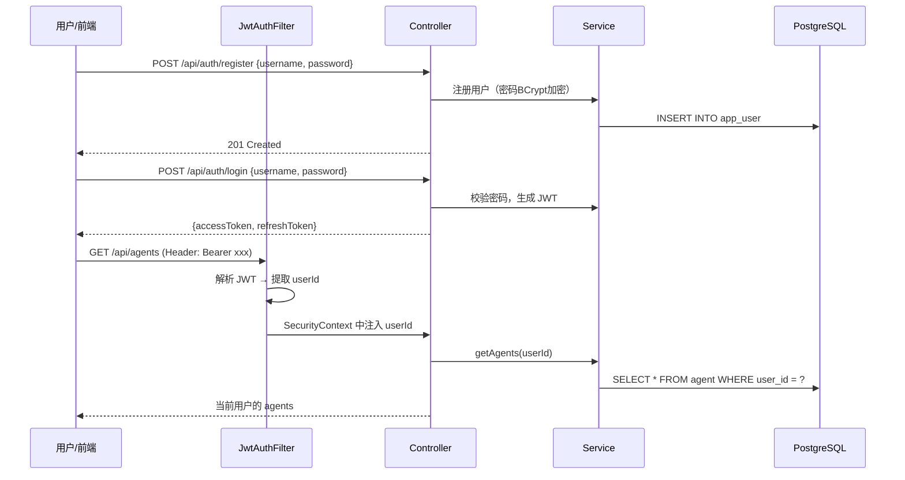

# 用户鉴权 + 多租户隔离 — 详细执行计划

> 基于对项目源码的深度分析，本计划精确到每个需要新建/修改的文件，分 5 个阶段执行。

---

## 整体架构设计



---

## 阶段一：数据库层 — 新建用户表 + 改造现有表（⏱️ 0.5 天）

### 1.1 新建 SQL 迁移脚本

**新建文件**: `jchatmind_sql/jchatmind_assert/auth_migration.sql`

```sql
-- ==================== 用户表 ====================
CREATE TABLE app_user (
    id UUID PRIMARY KEY DEFAULT gen_random_uuid(),
    username VARCHAR(50) NOT NULL UNIQUE,
    password VARCHAR(255) NOT NULL,       -- BCrypt 加密
    nickname VARCHAR(100),
    avatar_url TEXT,
    role VARCHAR(20) NOT NULL DEFAULT 'USER',  -- USER / ADMIN
    enabled BOOLEAN NOT NULL DEFAULT TRUE,
    created_at TIMESTAMP DEFAULT NOW(),
    updated_at TIMESTAMP DEFAULT NOW()
);

-- 用户名唯一索引
CREATE UNIQUE INDEX idx_app_user_username ON app_user(username);

-- ==================== 现有表加 user_id ====================
ALTER TABLE agent ADD COLUMN user_id UUID REFERENCES app_user(id);
ALTER TABLE chat_session ADD COLUMN user_id UUID REFERENCES app_user(id);
ALTER TABLE knowledge_base ADD COLUMN user_id UUID REFERENCES app_user(id);
ALTER TABLE long_term_memory ADD COLUMN user_id UUID REFERENCES app_user(id);

-- 查询加速索引
CREATE INDEX idx_agent_user_id ON agent(user_id);
CREATE INDEX idx_chat_session_user_id ON chat_session(user_id);
CREATE INDEX idx_knowledge_base_user_id ON knowledge_base(user_id);
```

> [!IMPORTANT]
> 表名用 `app_user` 而不是 `user`，因为 `user` 是 PostgreSQL 保留关键字。

### 1.2 影响评估

| 现有表 | 变更 | 影响范围 |
|--------|------|---------|
| `agent` | +`user_id` 列 | AgentMapper、AgentFacadeServiceImpl |
| `chat_session` | +`user_id` 列 | ChatSessionMapper、ChatSessionFacadeServiceImpl |
| `knowledge_base` | +`user_id` 列 | KnowledgeBaseMapper、KnowledgeBaseFacadeServiceImpl |
| `long_term_memory` | +`user_id` 列 | LongTermMemoryMapper、LongTermMemoryServiceImpl |

---

## 阶段二：后端鉴权核心（⏱️ 1.5 天）

### 2.1 添加 Maven 依赖

**修改文件**: [pom.xml](file:///d:/Antigravity-project/JChatMind-main/JChatMind-main/jchatmind/pom.xml)

```xml
<!-- Spring Security -->
<dependency>
    <groupId>org.springframework.boot</groupId>
    <artifactId>spring-boot-starter-security</artifactId>
</dependency>

<!-- JWT (jjwt) -->
<dependency>
    <groupId>io.jsonwebtoken</groupId>
    <artifactId>jjwt-api</artifactId>
    <version>0.12.6</version>
</dependency>
<dependency>
    <groupId>io.jsonwebtoken</groupId>
    <artifactId>jjwt-impl</artifactId>
    <version>0.12.6</version>
    <scope>runtime</scope>
</dependency>
<dependency>
    <groupId>io.jsonwebtoken</groupId>
    <artifactId>jjwt-jackson</artifactId>
    <version>0.12.6</version>
    <scope>runtime</scope>
</dependency>
```

### 2.2 新建文件清单

以下所有新文件均在 `com.kama.jchatmind` 包下：

```text
model/entity/AppUser.java          ← 用户实体
model/dto/AppUserDTO.java          ← 用户 DTO
model/request/LoginRequest.java    ← 登录请求
model/request/RegisterRequest.java ← 注册请求
model/response/LoginResponse.java  ← 登录响应（含 token）

mapper/AppUserMapper.java          ← 用户数据访问
resources/mapper/AppUserMapper.xml ← MyBatis SQL

service/AuthService.java           ← 认证服务接口
service/impl/AuthServiceImpl.java  ← 认证服务实现

security/JwtTokenProvider.java     ← JWT 工具类
security/JwtAuthFilter.java        ← 请求过滤器
security/SecurityConfig.java       ← Spring Security 配置
security/UserContext.java          ← 当前用户上下文（ThreadLocal）

controller/AuthController.java     ← 认证 API
```

### 2.3 核心类设计

#### `AppUser.java` — 用户实体

```java
@Data
@Builder
public class AppUser {
    private String id;
    private String username;
    private String password;    // BCrypt 加密存储
    private String nickname;
    private String avatarUrl;
    private String role;        // "USER" / "ADMIN"
    private Boolean enabled;
    private LocalDateTime createdAt;
    private LocalDateTime updatedAt;
}
```

#### `JwtTokenProvider.java` — JWT 工具类

```java
@Component
public class JwtTokenProvider {
    @Value("${jchatmind.auth.jwt-secret}")
    private String jwtSecret;
    
    @Value("${jchatmind.auth.access-token-expiration:3600000}")  // 默认 1h
    private long accessTokenExpiration;
    
    @Value("${jchatmind.auth.refresh-token-expiration:604800000}")  // 默认 7d
    private long refreshTokenExpiration;
    
    private SecretKey getSigningKey() { ... }
    
    public String generateAccessToken(String userId, String role) { ... }
    public String generateRefreshToken(String userId) { ... }
    public String getUserIdFromToken(String token) { ... }
    public boolean validateToken(String token) { ... }
}
```

#### `JwtAuthFilter.java` — 核心过滤器

```java
@Component
public class JwtAuthFilter extends OncePerRequestFilter {
    private final JwtTokenProvider tokenProvider;
    
    @Override
    protected void doFilterInternal(HttpServletRequest request,
                                     HttpServletResponse response,
                                     FilterChain filterChain) {
        // 1. 从 Header 提取 "Bearer xxx"
        // 2. 验证 token
        // 3. 解析 userId + role
        // 4. 设置 SecurityContext（UsernamePasswordAuthenticationToken）
        // 5. 设置 UserContext（ThreadLocal，方便 Service 层获取）
        // 6. chain.doFilter()
        // 7. finally 清理 UserContext
    }
}
```

#### `SecurityConfig.java` — 安全配置

```java
@Configuration
@EnableWebSecurity
public class SecurityConfig {
    @Bean
    public SecurityFilterChain filterChain(HttpSecurity http,
                                           JwtAuthFilter jwtAuthFilter) {
        return http
            .csrf(AbstractHttpConfigurer::disable)
            .sessionManagement(s -> s.sessionPolicy(STATELESS))
            .authorizeHttpRequests(auth -> auth
                // 放行：登录、注册、健康检查
                .requestMatchers("/api/auth/**", "/health").permitAll()
                // SSE 连接也需要鉴权（通过 query param 传 token）
                .requestMatchers("/sse/**").authenticated()
                // 其他所有接口需要认证
                .anyRequest().authenticated()
            )
            .addFilterBefore(jwtAuthFilter, UsernamePasswordAuthenticationFilter.class)
            .build();
    }
    
    @Bean
    public PasswordEncoder passwordEncoder() {
        return new BCryptPasswordEncoder();
    }
}
```

> [!WARNING]
> 引入 Spring Security 后，现有的 `CorsConfig` 需要改造！CORS 配置必须迁移到 `SecurityConfig` 中通过 `http.cors()` 配置，否则预检请求会被 Security 拦截返回 403。

#### `UserContext.java` — 用户上下文

```java
public class UserContext {
    private static final ThreadLocal<String> USER_ID = new ThreadLocal<>();
    
    public static void setUserId(String userId) { USER_ID.set(userId); }
    public static String getUserId() { return USER_ID.get(); }
    public static String requireUserId() {
        String id = USER_ID.get();
        if (id == null) throw new BizException("用户未登录");
        return id;
    }
    public static void clear() { USER_ID.remove(); }
}
```

> [!TIP]
> 用 `ThreadLocal` 而不是每个方法都传 `userId` 参数，好处是**不侵入现有 Service 方法签名**，只需要在 Service 内部调用 `UserContext.getUserId()` 即可。这是对现有代码最小侵入的方案。

#### `AuthController.java` — 认证接口

```java
@RestController
@RequestMapping("/api/auth")
public class AuthController {
    @PostMapping("/register")  // 注册
    @PostMapping("/login")     // 登录 → 返回 accessToken + refreshToken
    @PostMapping("/refresh")   // 刷新 token
    @GetMapping("/me")         // 获取当前用户信息（需认证）
}
```

### 2.4 SSE 鉴权方案

当前 SSE 使用 `EventSource` API，**不支持自定义 Header**。需要特殊处理：

```
方案：URL Query Param 传 token
GET /sse/connect/{chatSessionId}?token=xxx
```

**修改文件**: [SseController.java](file:///d:/Antigravity-project/JChatMind-main/JChatMind-main/jchatmind/src/main/java/com/kama/jchatmind/controller/SseController.java)

```java
@RequestMapping(value = "/connect/{chatSessionId}", produces = TEXT_EVENT_STREAM_VALUE)
public SseEmitter connect(@PathVariable String chatSessionId,
                          @RequestParam String token) {
    // 1. 手动验证 token
    // 2. 校验该 session 是否属于当前用户
    // 3. 建立连接
}
```

**修改文件**: 前端 [AgentChatView.tsx](file:///d:/Antigravity-project/JChatMind-main/JChatMind-main/ui/src/components/views/AgentChatView.tsx) L142

```typescript
// 修改前
const es = new EventSource(`http://localhost:8080/sse/connect/${chatSessionId}`);
// 修改后
const token = localStorage.getItem("accessToken");
const es = new EventSource(`http://localhost:8080/sse/connect/${chatSessionId}?token=${token}`);
```

---

## 阶段三：数据隔离改造（⏱️ 1 天）

这是工作量最大但最关键的部分。核心思路：**所有查询加上 `user_id` 过滤**。

### 3.1 Mapper 层改造

| Mapper | 改造内容 |
|--------|---------|
| `AgentMapper` | `selectAll()` → `selectByUserId(userId)` ，`insert()` 加 `user_id` |
| `ChatSessionMapper` | `selectAll()` → `selectByUserId(userId)` ，`selectByAgentId()` 加 `user_id` 条件 |
| `KnowledgeBaseMapper` | `selectAll()` → `selectByUserId(userId)` |
| `LongTermMemoryMapper` | 已有 `agentId` 过滤，加 `user_id` 增强 |

示例 — **AgentMapper 改造**:

```java
@Mapper
public interface AgentMapper {
    int insert(Agent agent);                          // entity 中已含 userId
    Agent selectById(String id);
    List<Agent> selectByUserId(String userId);        // 替换 selectAll
    int deleteById(String id);
    int updateById(Agent agent);
}
```

对应 MyBatis XML:
```xml
<select id="selectByUserId" resultType="Agent">
    SELECT * FROM agent WHERE user_id = #{userId} ORDER BY created_at DESC
</select>
```

### 3.2 Entity 层改造

**修改文件列表**（每个加 `userId` 字段）:

- [Agent.java](file:///d:/Antigravity-project/JChatMind-main/JChatMind-main/jchatmind/src/main/java/com/kama/jchatmind/model/entity/Agent.java) — 加 `private String userId;`
- [ChatSession.java](file:///d:/Antigravity-project/JChatMind-main/JChatMind-main/jchatmind/src/main/java/com/kama/jchatmind/model/entity/ChatSession.java) — 加 `private String userId;`
- `KnowledgeBase.java` — 加 `private String userId;`

### 3.3 Service 层改造

核心改动模式（以 `AgentFacadeServiceImpl` 为例）:

```java
// 修改前
public GetAgentsResponse getAgents() {
    List<Agent> agents = agentMapper.selectAll();
    // ...
}

// 修改后
public GetAgentsResponse getAgents() {
    String userId = UserContext.requireUserId();
    List<Agent> agents = agentMapper.selectByUserId(userId);
    // ...
}
```

**需要加权限校验的操作**（防止越权）:

```java
// 删除/更新前校验归属
public void deleteAgent(String agentId) {
    Agent agent = agentMapper.selectById(agentId);
    if (agent == null) throw new BizException("智能体不存在");
    if (!agent.getUserId().equals(UserContext.requireUserId())) {
        throw new BizException("无权操作该智能体");
    }
    agentMapper.deleteById(agentId);
}
```

### 3.4 完整改造清单

```text
需改造的 Service 文件（共 6 个）:
├── AgentFacadeServiceImpl.java       ← getAgents / createAgent / deleteAgent / updateAgent
├── ChatSessionFacadeServiceImpl.java ← getChatSessions / createChatSession / deleteChatSession
├── ChatMessageFacadeServiceImpl.java ← createChatMessage 时校验 session 归属
├── KnowledgeBaseFacadeServiceImpl.java ← 同上模式
├── DocumentFacadeServiceImpl.java    ← 通过 KB 间接校验归属
└── LongTermMemoryServiceImpl.java    ← 记忆写入时关联 userId

需改造的 Mapper XML 文件（共 4 个）:
├── AgentMapper.xml
├── ChatSessionMapper.xml
├── KnowledgeBaseMapper.xml
└── LongTermMemoryMapper.xml
```

---

## 阶段四：前端适配（⏱️ 1 天）

### 4.1 新建文件

```text
ui/src/
├── api/auth.ts                    ← 登录/注册/刷新 API
├── contexts/AuthContext.tsx        ← 全局认证状态管理
├── components/views/LoginView.tsx  ← 登录/注册页面
└── utils/token.ts                 ← Token 存取工具
```

### 4.2 HTTP 层改造

**修改文件**: [http.ts](file:///d:/Antigravity-project/JChatMind-main/JChatMind-main/ui/src/api/http.ts)

```typescript
// 在 defaultHeaders 中注入 Authorization
const defaultHeaders: HeadersInit = {
  "Content-Type": "application/json",
  ...headers,
};

// 改为：
const token = localStorage.getItem("accessToken");
const defaultHeaders: HeadersInit = {
  "Content-Type": "application/json",
  ...(token ? { Authorization: `Bearer ${token}` } : {}),
  ...headers,
};

// 在 handleResponse 中处理 401
if (response.status === 401) {
  // 尝试 refresh token，失败则跳转登录页
  localStorage.removeItem("accessToken");
  window.location.href = "/login";
  throw new Error("登录已过期");
}
```

### 4.3 路由守卫

**修改文件**: [App.tsx](file:///d:/Antigravity-project/JChatMind-main/JChatMind-main/ui/src/App.tsx)

```tsx
function App() {
  return (
    <AuthProvider>
      <Routes>
        <Route path="/login" element={<LoginView />} />
        {/* 受保护路由 */}
        <Route element={<ProtectedRoute />}>
          <Route path="/*" element={<JChatMindLayout />} />
        </Route>
      </Routes>
    </AuthProvider>
  );
}

// 路由守卫组件
function ProtectedRoute() {
  const { isAuthenticated } = useAuth();
  return isAuthenticated ? <Outlet /> : <Navigate to="/login" />;
}
```

### 4.4 登录页面

新建 `LoginView.tsx`，包含：
- 登录/注册切换表单（用 Ant Design `Form` + `Tabs`）
- 调用 `/api/auth/login` 或 `/api/auth/register`
- 成功后将 token 存入 `localStorage`，跳转主页

---

## 阶段五：联调 & 安全加固（⏱️ 0.5 天）

### 5.1 配置项

在 `application.yaml` 中新增:

```yaml
jchatmind:
  auth:
    jwt-secret: ${JWT_SECRET:your-256-bit-secret-key-here-change-in-production}
    access-token-expiration: 3600000     # 1 小时
    refresh-token-expiration: 604800000  # 7 天
```

### 5.2 安全检查清单

| 检查项 | 说明 |
|--------|------|
| ✅ 密码加密 | BCrypt，不存明文 |
| ✅ JWT 签名 | HMAC-SHA256，密钥从环境变量注入 |
| ✅ Token 过期 | Access 1h + Refresh 7d |
| ✅ CORS 改造 | 迁移到 SecurityConfig |
| ✅ SSE 鉴权 | Query param 传 token |
| ✅ 越权校验 | 操作前检查资源归属 |
| ✅ SQL 注入 | MyBatis 参数化查询（已有） |
| ✅ 全局异常 | 401/403 返回统一格式 |

### 5.3 GlobalExceptionHandler 增强

**修改文件**: [GlobalExceptionHandler.java](file:///d:/Antigravity-project/JChatMind-main/JChatMind-main/jchatmind/src/main/java/com/kama/jchatmind/exception/GlobalExceptionHandler.java)

```java
// 新增 Spring Security 异常处理
@ExceptionHandler(AccessDeniedException.class)
@ResponseStatus(HttpStatus.FORBIDDEN)
public ApiResponse<Void> handleAccessDenied(AccessDeniedException e) {
    return ApiResponse.error("没有权限访问该资源");
}
```

---

## 执行顺序 & 依赖关系

```mermaid
gantt
    title 鉴权+多租户 实施计划
    dateFormat  X
    axisFormat %s天

    section 阶段一 数据库
    新建 app_user 表           :a1, 0, 0.25d
    现有表加 user_id           :a2, after a1, 0.25d

    section 阶段二 后端鉴权
    添加 Maven 依赖            :b1, after a2, 0.1d
    JWT + Security 核心类      :b2, after b1, 1d
    AuthController             :b3, after b2, 0.4d

    section 阶段三 数据隔离
    Mapper 层改造              :c1, after b3, 0.4d
    Entity 加 userId           :c2, after b3, 0.1d
    Service 层改造             :c3, after c1, 0.5d

    section 阶段四 前端
    HTTP 层注入 token          :d1, after b3, 0.3d
    登录页面 + 路由守卫        :d2, after d1, 0.7d

    section 阶段五 联调
    SSE 鉴权改造               :e1, after c3, 0.2d
    安全加固 + 测试            :e2, after d2, 0.3d
```



---

## 面试可深聊的设计决策

| 决策点 | 选择 | 为什么 |
|--------|------|--------|
| 鉴权方案 | JWT 无状态 | 与现有 RESTful 架构一致，不引入 Session 存储 |
| 数据隔离 | Service 层 UserContext | 最小侵入，不改方法签名 |
| SSE 鉴权 | Query param | EventSource 不支持自定义 Header，这是业界标准做法 |
| Token 刷新 | 双 Token | Access 短期 + Refresh 长期，兼顾安全和体验 |
| 密码加密 | BCrypt | 自带 salt，抗彩虹表攻击 |
| 表名 | `app_user` | 避免 PostgreSQL 保留关键字冲突 |
