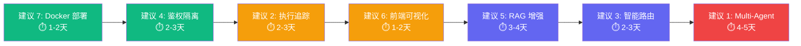

# JChatMind 扩展建议 — 面试加分点

> 基于对项目源码的深度分析，以下建议按「面试吸引力」从高到低排列。每个建议都标注了**面试官关注的核心能力**和**落地难度**。

---

## 一、当前项目优势分析

你的项目已经具备了不错的基础：

| 维度 | 已有能力 | 面试得分点 |
|------|---------|-----------|
| Agent 架构 | Think → Execute → Tool → Loop 完整闭环 | ✅ 展示了对 AI Agent 范式的理解 |
| RAG | 文档解析 → 分块 → Embedding → pgvector 检索 | ✅ 完整链路，不是玩具 Demo |
| 记忆系统 | Redis 短期 + PostgreSQL 长期，双层设计 | ✅ 说明你理解生产级记忆系统 |
| 流式响应 | SSE 推送 + 前端逐 token 渲染 | ✅ 用户体验导向思维 |
| 工具系统 | 可插拔注册，支持 terminate 等内置工具 | ✅ 开放可扩展 |

**但以下几个方面是面试官很可能深挖的薄弱点**，也正是你的扩展机会：

---

## 二、高价值扩展建议

### 🔥 建议 1：Multi-Agent 协作机制（难度：⭐⭐⭐⭐）

**面试官关注**: 系统设计能力、分布式协调、架构抽象

**现状问题**: 当前 `JChatMind.java` 是单 Agent 独立运行，每次对话只有一个 Agent 在 Loop。面对复杂任务（如"帮我写一篇技术博客，先搜索资料再写作再排版"），单 Agent 很难做好所有事。

**扩展思路**:
```
用户请求 → Orchestrator Agent（调度者）
                ├── Research Agent（资料搜索）
                ├── Writer Agent（内容生成）
                └── Review Agent（质量审核）
```

- **实现 `AgentOrchestrator` 类**：管理多个 JChatMind 实例之间的消息传递和任务分发
- **定义 Agent 间通信协议**：基于消息队列或内存 Channel，每个 Agent 输出作为下一个 Agent 的输入
- **引入 DAG 任务编排**：让 Orchestrator 根据任务依赖关系并行/串行调度 Agent
- **状态同步**：通过 Redis 共享 Agent 间的中间状态

**面试可聊的点**:
- Agent 间如何避免循环调用？（引入深度限制 + 任务 ID 去重）
- 如何做错误隔离？（单个 Agent 失败不影响全局）
- 与 LangGraph / CrewAI 等框架的对比思考

---

### 🔥 建议 2：可观测性 & Agent 执行追踪（难度：⭐⭐⭐）

**面试官关注**: 生产落地能力、排查问题能力、系统运维思维

**现状问题**: 目前 Agent 的执行过程只有 `log.info` 级别的日志，没有结构化追踪。如果出了问题（模型幻觉、工具调用失败、死循环），很难回溯定位。

**扩展思路**:
```
                        ┌─────────────────────────┐
  Agent Run             │    Trace / Span 追踪     │
  ┌─────────┐          │                         │
  │ think() ├────────►  │  Span: think_step_1     │
  │         │          │  ├── prompt_tokens: 1200  │
  │         │          │  ├── completion_tokens: 80│
  │ execute()├────────► │  Span: tool_call_email   │
  │         │          │  ├── latency: 320ms       │
  │         │          │  ├── result: success      │
  │ think() ├────────►  │  Span: think_step_2     │
  └─────────┘          │  └── final_answer: ...    │
                        └─────────────────────────┘
```

- **引入 `AgentTrace` 数据结构**：每次 `run()` 生成一个 Trace，每个 `step()` 生成一个 Span
- **记录关键指标**：每步的 token 消耗、延迟、工具名称、工具返回、模型选择
- **前端可视化**：新增一个「执行链路」面板，展示 Agent 的推理过程（类似 LangSmith）
- **持久化到数据库**：支持历史回溯，辅助优化 Prompt

**关键技术词**: OpenTelemetry、Trace/Span 模型、结构化日志、指标聚合

**面试可聊的点**:
- 如何设计 Trace 的数据模型使其既通用又不过度耦合 Agent 逻辑？
- Token 消耗追踪对成本控制的价值
- 对比 LangSmith / LangFuse 的设计思路

---

### 🔥 建议 3：智能路由 & 模型降级策略（难度：⭐⭐⭐）

**面试官关注**: 高可用设计、成本优化意识、工程判断力

**现状问题**: `MultiChatClientConfig` 目前是静态注册多个模型，但没有智能路由（根据任务复杂度选模型）和降级机制（某模型不可用时自动切换）。

**扩展思路**:

```java
// 智能路由器
public class ModelRouter {
    // 简单问答 → 小模型（低成本）
    // 复杂推理 → 大模型（高质量）
    // 主模型超时 → 自动降级到备选模型
    
    public ChatClient route(String query, AgentConfig config) {
        int complexity = estimateComplexity(query);
        if (complexity < THRESHOLD_SIMPLE) {
            return cheapModel;  // DeepSeek-Chat
        }
        return premiumModel;    // DeepSeek-R1 / GPT-4o
    }
}
```

- **任务复杂度评估**：基于 query 长度、是否包含代码/数学、历史上下文轮数等启发式规则
- **熔断降级**：引入 Resilience4j，当主模型连续失败 N 次时自动切换
- **成本追踪**：记录每次调用的 token 消耗和费用，支持按用户/Agent 维度统计
- **A/B 测试框架**：同一查询同时发给两个模型，对比输出质量

**面试可聊的点**:
- 模型选择的 trade-off：延迟 vs 质量 vs 成本
- 如何设计熔断阈值？（动态自适应 vs 固定阈值）
- 与 API Gateway 层面限流的区别

---

### 🔥 建议 4：用户鉴权 + 多租户隔离（难度：⭐⭐⭐）

**面试官关注**: 安全意识、后端基本功、系统完整性

**现状问题**: README 的「后续规划」里已经提到了这一点，说明你意识到了。但没做就是明显的短板——面试官会认为这是一个只有 Demo 水平的项目。

**扩展思路**:
- **JWT + Spring Security**：标准的认证鉴权方案
- **数据隔离**：所有查询加上 `user_id` 过滤，Agent/Session/Knowledge Base 都绑定用户
- **RBAC 权限模型**：普通用户 / 管理员 / API Key 三种角色
- **SSE 连接鉴权**：当前 `/sse/connect/{chatSessionId}` 无鉴权，任何人知道 sessionId 就能监听——这是安全漏洞

**为什么这个加分？**:
- 面试官普遍认为"安全"是区分初级和中级工程师的分水岭
- 实现 JWT 不难，但能说清楚 Token 刷新策略、无状态 vs 有状态 session、XSS/CSRF 防护才是亮点

---

### 🔥 建议 5：知识库增强 — 多格式文档 + 混合检索（难度：⭐⭐⭐）

**面试官关注**: RAG 深度理解、信息检索功底、工程化处理能力

**现状问题**: 当前只支持 Markdown 文档（`MarkdownParserServiceImpl`），检索只用了向量相似度。这在面试中容易被追问："如果用户上传 PDF/Word 怎么办？纯向量检索的召回率够吗？"

**扩展思路**:

| 维度 | 当前 | 扩展后 |
|------|------|--------|
| 文档格式 | Markdown only | PDF / Word / HTML / 纯文本 |
| 分块策略 | 固定分块 | 语义分块 + 递归分块 |
| 检索方式 | 纯向量检索 | 混合检索（向量 + BM25 关键词） |
| 重排序 | 无 | Cross-Encoder / Cohere Rerank |

- **文档解析**：引入 Apache Tika 或 PDFBox 处理多格式文档
- **混合检索**：在 pgvector 向量检索基础上，增加 PostgreSQL 全文索引做 BM25 检索，通过 RRF（Reciprocal Rank Fusion）融合排序
- **查询重写增强**：当前 `QueryRewriteServiceImpl` 已有基础，可以加入 HyDE（Hypothetical Document Embedding）策略
- **分块后元数据**：每个 chunk 保留来源文档、标题层级、页码等信息，提升可解释性

**面试可聊的点**:
- 向量检索 vs 关键词检索的互补性分析
- 分块大小对检索质量的影响（过大丢失精度，过小丢失语义）
- Rerank 模型在 RAG pipeline 中的 ROI

---

### 🔥 建议 6：前端 — Agent 思维链可视化（难度：⭐⭐）

**面试官关注**: 产品思维、前端工程能力、用户体验

**现状问题**: 当前前端的 SSE 处理已有 `AI_PLANNING` / `AI_THINKING` / `AI_EXECUTING` 等状态类型，但只是显示状态文本。Agent 的推理过程对用户是黑盒的。

**扩展思路**:
```
┌─────────────────────────────────────────────────────┐
│  🤖 Agent 正在处理你的请求...                         │
│                                                     │
│  Step 1 ✅ 理解用户意图                              │
│  Step 2 ✅ 搜索知识库「项目部署文档」                   │
│  Step 3 🔄 调用工具 send_email                       │
│       └─ 参数: {to: "xxx", subject: "..."}          │
│  Step 4 ⏳ 等待中...                                │
│                                                     │
│  📊 Token 消耗: 1,234 / 成本: ¥0.02                 │
└─────────────────────────────────────────────────────┘
```

- **前端新增 `ThinkingChain` 组件**：按步骤展示 Agent 的推理链
- **工具调用可视化**：展示工具名称、参数、返回值、耗时
- **可折叠/展开**：默认折叠中间步骤，只展示最终答案
- **动画效果**：Step 切换时有流畅的过渡动画

**为什么这个加分**:
- 展示你对产品体验的关注，不只是"能用"而是"好用"
- 这是 ChatGPT / Claude 等商业产品都在做的方向，说明你关注行业趋势

---

### 🔥 建议 7：Docker Compose 一键部署 + CI/CD（难度：⭐⭐）

**面试官关注**: DevOps 意识、工程完整性、协作能力

**现状问题**: README 的「后续规划」提到了 Docker Compose，但目前没有实现。面试时如果面试官想本地跑你的项目，需要手动装 PostgreSQL、Redis、pgvector——大概率直接放弃。

**扩展思路**:

```yaml
# docker-compose.yml
services:
  postgres:
    image: pgvector/pgvector:pg16
    # ...
  redis:
    image: redis:7-alpine
    # ...
  backend:
    build: ./jchatmind
    depends_on: [postgres, redis]
    # ...
  frontend:
    build: ./ui
    # ...
```

- **Docker Compose**：一条命令启动全部服务，`docker compose up -d`
- **GitHub Actions CI**：PR 时自动编译、lint、跑测试
- **多环境配置**：`application-dev.yaml` / `application-prod.yaml`
- **健康检查**：Docker healthcheck + Spring Actuator

**为什么这个加分**:
- 说明你有"交付意识"，不是写完代码就结束
- 面试官能 30 秒跑起你的项目 = 好印象翻倍

---

## 三、优先级建议

如果时间有限，推荐按以下顺序实施：



> [!TIP]
> **建议 7（Docker）和 建议 4（鉴权）是"门槛型"扩展**——没有它们，项目会被认为是 Demo 级别。先做这两个，再做其他的才有锦上添花的效果。

---

## 四、面试话术建议

在描述项目时，建议用以下结构：

1. **项目定位**："这是一个基于 Spring AI 的 AI Agent 平台，核心是实现了 Agent Loop 的完整闭环"
2. **技术亮点**：挑 2-3 个深入讲（推荐 Agent Loop、记忆系统、RAG）
3. **工程实践**：强调 SSE 流式、可插拔工具、长短期记忆分层设计
4. **深度思考**：主动提到你做了哪些 trade-off（如为什么用 pgvector 而不是单独的向量数据库、为什么自己实现 Agent Loop 而不是用 LangChain）
5. **持续迭代**：提到你正在做的扩展（从上面选 1-2 个已经开始做的）

> [!IMPORTANT]
> 面试官最看重的不是你用了多少技术，而是**你能不能清楚地说出为什么这么设计、有什么 trade-off、遇到了什么问题怎么解决的**。每个扩展建议，请确保你能深入回答"为什么"。
